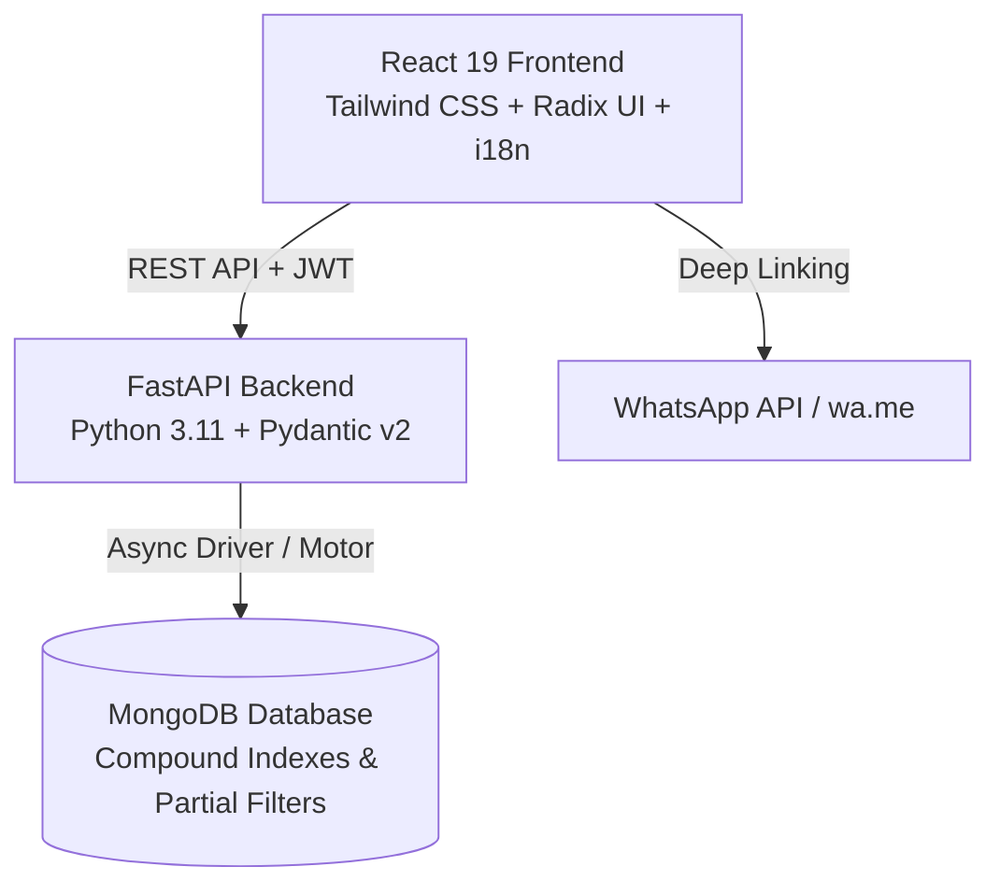

# Everyday Appointments (എവരിഡേ അപ്പോയിന്റ്മെന്റ്സ്)

> **A bilingual (Malayalam & English), mobile-first clinic appointment scheduling and token management web application designed specifically for local healthcare clinics and patients in Kerala.**

---

## 📌 Executive Summary

**Everyday Appointments** is a production-grade healthcare scheduling platform that bridges the gap between rural/semi-urban healthcare clinics and patients. Built with a focus on simplicity and accessibility, it eliminates long waiting queues by providing real-time token booking, live clinic consultation ledgers, automated WhatsApp confirmations/reminders, and role-based portals for Patients, Clinic Staff, and Platform Administrators.

---

## ✨ Key Features & Capabilities

### 🧑‍⚕️ 1. Patient Experience (High Accessibility & Mobile-First)
- **Passwordless OTP Authentication**: Quick, frictionless login via mobile phone number with intelligent returning-patient recognition (auto-fills name and location).
- **Interactive Slot & Token Booking**: Visual slot picker that respects clinic operating hours, break intervals, and automatic holiday/Sunday closures.
- **WhatsApp Direct Integration**: Instant one-click confirmation with pre-filled WhatsApp tokens (`wa.me` deep links) sent directly to the clinic or patient.
- **My Bookings Management**: Real-time tracking of upcoming and past visits with instant cancellation capabilities.
- **Full Bilingual Support**: 100% native Malayalam (മലയാളം) and English localization toggle with persistent user preferences.

### 🏥 2. Clinic Dashboard & Queue Management (Reception/Doctor Portal)
- **Live Consultation Ledger**: Real-time token queue with live status transitions (`Waiting` ➔ `In Consultation` ➔ `Completed` ➔ `No Show` ➔ `Cancelled`).
- **Walk-in / Call-in Booking**: Quick appointment creation for on-the-spot patients or telephone inquiries with automatic next-token allocation.
- **One-Click Print Ledger**: Clean, CSS-optimized printable daily patient schedule for reception clipboards.
- **Emergency Mass Cancellation**: Single-click bulk cancellation for doctor unavailability with automated personalized WhatsApp notification generation for all affected patients.
- **Morning WhatsApp Reminder**: Generates daily briefing summaries with total booking counts and first appointment times for clinic staff.
- **Customizable Clinic Settings**: Configure working days, start/end hours, custom slot durations (5–120 min), lunch breaks, and advance booking windows (up to 180 days).

### 🛠️ 3. Platform Super Admin Portal
- **Clinic Lifecycle Management**: Onboard, monitor, update, and manage multiple clinics across regions.
- **State-Level Holiday Automation**: Configurable public holiday calendar (pre-seeded with official Kerala Public Holidays) to prevent booking on non-working days.
- **System Analytics**: Real-time metrics tracking total clinics, active patients, historical bookings, and upcoming consultations.

---

## 🏗️ Architecture & Technology Stack



| Layer | Technology | Key Highlights & Libraries |
|---|---|---|
| **Frontend** | React 19, JavaScript (ES6+) | Tailwind CSS, Radix UI Primitives, Lucide Icons, Sonner Toasts, CRACO |
| **State & Data** | React Context + Axios | Modular SessionProvider, LangProvider (i18n engine), SWR |
| **Backend** | Python 3.11, FastAPI, Uvicorn | Async I/O (AsyncIO), Pydantic v2 validation, JWT authentication, Bcrypt |
| **Database** | MongoDB (Motor Async Driver) | Atomic booking transactions, unique compound indices with partial filter expressions |
| **Security** | Role-Based Access Control (RBAC) | Secure JWT tokens with claims validation (`patient`, `clinic`, `admin`), CORS middleware |

---

## 🔒 Concurrency & Reliability Engineering

- **Atomic Double-Booking Prevention**: Utilizes MongoDB unique compound indexes with partial filter expressions (`clinic_id`, `date`, `slot_time`) scoped strictly to active booking states (`waiting`, `in_consultation`, `completed`), preventing race conditions and simultaneous bookings.
- **High-Resilience Slot Engine**: Dynamic algorithm calculating available time slots by parsing working hours, custom slot durations, and excluding configured break intervals and gazetted holidays.

---

## 📂 Project Structure

```
everyday-appointments/
├── backend/
│   ├── server.py              # FastAPI server, business logic & REST API endpoints
│   ├── requirements.txt       # Python dependencies
│   ├── pytest.ini             # Pytest configuration
│   └── tests/                 # Comprehensive API test suite (40+ automated tests)
├── frontend/
│   ├── public/                # Static assets & HTML template
│   ├── src/
│   │   ├── components/        # Reusable UI components & TopBar
│   │   ├── constants/         # Test IDs & layout constants
│   │   ├── hooks/             # Custom React hooks
│   │   ├── lib/               # i18n localization engine & session management
│   │   ├── pages/
│   │   │   ├── admin/         # Super Admin dashboards & login
│   │   │   ├── clinic/        # Clinic reception ledger, settings & emergency cancel
│   │   │   ├── patient/       # Booking flows, receipts, & history
│   │   │   └── RoleLanding.jsx# Unified role-based landing portal
│   │   ├── App.js             # Route declarations & role guards
│   │   └── index.css          # Tailwind CSS styles & print media queries
│   └── package.json           # Node.js dependencies & scripts
└── design_guidelines.json     # Design system & accessibility tokens
```

---

## 🚀 Getting Started Locally

### Prerequisites
- Node.js (v18+) & Yarn / npm
- Python 3.10+
- MongoDB (Running locally on `localhost:27017` or via MongoDB Atlas)

### 1. Backend Setup
```bash
cd backend
python -m venv venv
source venv/bin/activate    # On Windows: venv\Scripts\activate
pip install -r requirements.txt

# Create .env file
cat <<EOF > .env
MONGO_URL=mongodb://localhost:27017
DB_NAME=everyday_appointments
JWT_SECRET=your_jwt_secret_key
SUPER_ADMIN_EMAIL=admin@everyday-appointments.app
SUPER_ADMIN_PASSWORD=admin1234
EOF

# Start the server
uvicorn server:app --reload --port 8000
```

### 2. Frontend Setup
```bash
cd frontend
yarn install   # or npm install

# Start development server
yarn start     # or npm start
```
*Frontend runs at `http://localhost:3000` and proxies API requests to `http://localhost:8000`.*

---

## 🧪 Automated Testing

The backend includes a comprehensive suite of automated tests covering authentication, concurrency, role isolation, slot engine correctness, and emergency cancellation workflows.

```bash
cd backend
pytest tests/ -v
```

---

## 📄 Resume Bullet Points (Ready to Copy)

- **Full-Stack Healthcare Appointment & Queue Management System**: Engineered a high-availability scheduling platform using **FastAPI**, **React 19**, and **MongoDB**, cutting patient wait times through automated digital token allocation.
- **High-Concurrency Booking Engine**: Designed an atomic slot allocation engine utilizing MongoDB compound indices with partial filter expressions to eliminate race conditions and double bookings during peak traffic.
- **Bilingual & WhatsApp Ecosystem**: Implemented full English and Malayalam localization alongside direct WhatsApp deep-linking for instant receipt dispatch and emergency cancellation alerts.
- **Role-Based Multi-Tenancy Architecture**: Built isolated authentication and permission layers (JWT + Bcrypt) supporting Super Admins, Clinic Receptionists, and Patients with customized dashboards and live consultation ledgers.
